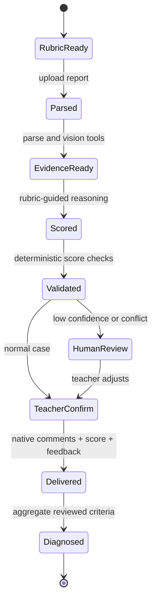

# 技术架构与迁移说明

## 技术栈判断

无界应用赛道不强制某个模型、Agent 框架或平台。允许使用商业 API、闭源模型和既有项目，但要说明调用环节、费用与锁定风险、替代方案、原项目来源、新增贡献和许可证兼容性。

因此参赛版保留已经验证过的主栈：

- 前端：Vue 3、TypeScript、Vite、Element Plus；
- 后端：FastAPI、asyncio、WebSocket；
- Agent：MiniMax-M3 + 显式工具调用/结构化 rubric，不依赖黑盒低代码编排；
- 文档：python-docx、PyMuPDF、LibreOffice；
- 数据：JSON 文件与 Excel，后续可替换为数据库；
- 模型：生产使用 MiniMax Anthropic 兼容协议，客户端保留可替换边界；
- 部署：Docker Compose。

真正需要调整的是工程可复现与开放边界，而不是为了参赛重写前后端。

## 双运行配置

### 可复现配置

当前无密钥配置使用确定性规则完成同一 `GradeTrace` 闭环，供断网回归和评委复现。未来若补充本地开源权重模型，需要先形成模型版本、量化方式和显存基准；在此之前不把“可替换协议”写成已经验证的本地模型能力。

### 快速 Demo 配置

生产 Demo 已复用根项目 `MiniMax-M3 + Anthropic 兼容协议`。应用只读取运行时环境变量，不加载已下线的备用模型；每次任务记录供应商类别、模型、耗时、Token、图片发送数量和降级状态，但不记录密钥或完整报告正文。

两种配置共享同一 `BaseLLMClient`、rubric、工具协议和评测集，以降低迁移成本。

真实模型前置一个隐私/证据适配层：报告先本地解析，姓名、学号、手机号、邮箱和身份证号等可识别字段被替换；只把有界证据目录送入模型。图片默认仅发送邻近文本，教师显式授权后才发送最多 4 张、合计最多 6 MiB。解析器同时保留图片在原 DOCX 中的段落序号；模型观察到的图片证据使用 `image:1@paragraph:NN` 定位。模型只能引用目录中存在的 `evidence_id`，输出经过维度集合、分值范围、正分证据和总分一致性校验。

Word 交付层不是简单生成一份新报告：

1. 复制教师上传的原 DOCX，保留正文、表格、图片和版式；
2. 按证据定位在文本段落或图片所在段落写入 OOXML 原生批注；
3. 教师终审后重新生成交付物，把最终分和教师说明写回；
4. 识别到课程固定成绩表时填写原有区域；未知模板则追加统一的“教师批改意见”页；
5. 返回批注数、图片批注数、成绩/评语写入状态和交付模式，供前端与自动化验收。

PDF 可以作为输入参与证据评分，但因为不存在可保真的原 Word，当前只交付证据 JSON，不宣称完成 Word 原位回写。

## Agent 状态机

每个状态都应记录输入摘要、工具调用、模型和配置版本、输出、异常与耗时。`GradeTrace` 是评分阶段的最小审计契约。

## 独立仓库边界

公开仓库只保留参赛产品运行所需的 Web、模型适配、文档工具与 `goaihz/` 产品层：

- `RUBRICS_DIR` 环境变量让同一运行时只加载参赛 rubric；
- `goaihz/src/labtrace` 提供证据契约、隐私处理与学情诊断模块；
- `goaihz/data/synthetic` 保证公开仓库和演示材料不携带真实学生数据；
- `goaihz/project.json` 固化原项目来源、公开仓库与新增贡献边界。

## 迁移里程碑

1. 已完成：参赛 profile、通用 rubric、`GradeTrace` 证据契约、合成 DOCX、隐私验证和学情诊断。
2. 已完成：公开 `/education/` 前端与 `/labtrace-api`，真实解析 DOCX，展示证据引用、低置信度复核、教师调整、Word 原生批注、成绩/教师评语回写和班级诊断。
3. 已完成：无密钥确定性适配器、双案例端到端 API 测试、浏览器验收、500 字作品简介和 11 页方案 PPT/PDF。
4. 已完成：MiniMax-M3 输出映射 `GradeTrace`、最多两次定向修复、超时/额度/契约显式降级、教师 rubric JSON、自动脱敏、图片单任务授权、图片到原 Word 段落定位和任意模板批改页。
5. 复赛前：增加批量队列、持久化、课程权限和 30 份授权教师金标评测。
6. 决赛前：冻结模型与依赖版本，提供失败注入、指标报告和答辩备份。

## 主要技术债

- 当前任务与成绩主要使用 JSON 持久化，需要并发和权限设计；
- 真实模型已输出可定位 `evidence_id`，但置信度仍需在教师金标上校准；
- 图片直接分析是显式授权能力，尚未形成分学科视觉质量基准；图片批注当前锚定图片所在段落，不做像素级框选；
- 学情诊断是确定性基线，尚未把教师调整原因用于后续 rubric 校准；
- 独立仓库已采用 Apache-2.0；仍需持续维护依赖许可证清单，并防止真实课程数据和密钥进入版本控制。
