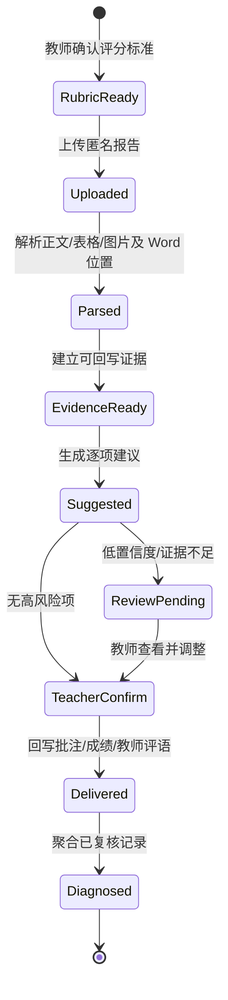

# 高校实验报告批改 Agent 闭环演示方案

版本：`v0.2`
更新日期：2026-07-30
适用阶段：GOAI 2026 初赛现场/录屏演示，以及复赛 Demo 的功能基线

## 1. 演示只证明一件事

教师上传一份带正文、表格和图片的匿名 Word 后，Agent 能围绕教师确认的评分标准完成材料解析、证据定位、逐项评分和风险识别；低置信度判断不会自动发布，而是由教师查看证据、调整分数并确认。系统随后把原生批注、最终成绩和教师评语写回可编辑 Word，并只用已复核记录生成班级学情诊断。

这条链路的核心不是“模型打出一个分数”，而是：

> 一项建议为什么得分、依据在 Word 的哪一段或哪张图、教师改了什么，以及确认后的批注、成绩和评语如何回到原文档，都可以被演示和复查。

## 2. 用户、痛点与价值假设

### 目标用户

- 每学期需要批改几十到数百份 Word/PDF 实验报告的高校教师；
- 承担初筛、批注和成绩汇总工作的课程助教；
- 需要跨班级复用 rubric、复盘共性问题的课程组。

### 演示中的具体痛点

- 一份报告同时包含正文、数据表、结果图和误差讨论，人工来回定位耗时；
- 只给总分无法解释评分依据，也难以处理课程要求差异；
- 聊天框里的评分建议还要由教师手工复制到 Word，任务没有真正完成；
- 模型对“分析是否充分”等判断存在不确定性，不能直接成为正式成绩；
- 批改单份报告后，教师仍需手工汇总全班薄弱点。

### 可验证价值

| 价值 | Demo 中的可见证据 |
|---|---|
| 减少机械查找 | 过敏原案例自动统计 21 个正文段落、6 个数据表格、1 张结果图并生成 9 条证据引用 |
| 让评分可追溯 | 六个评分维度均显示理由、置信度和 `evidence_id` |
| 保留教师裁量 | 62% 低置信度维度进入终审，教师将 8 分调整为 10 分 |
| 形成交付结果 | 最终 70 分，下载已写入原生批注、教师评语和成绩的可编辑 DOCX |
| 支持后续教学 | 仅聚合 4 份已复核记录，识别班级最弱维度并给出讲评建议 |

以上分数是关闭模型后的确定性回归结果，用于断网验收，不代表 MiniMax 的固定输出或真实课程评测结论。生产 Demo 会展示当次模型分数、Token、耗时和是否降级。

## 3. 当前可演示能力边界

| 环节 | 当前实现 | 演示口径 |
|---|---|---|
| 评分标准 | 默认六维、100 分通用 rubric；支持上传 2–12 维、1–200 分的教师 JSON | 加载时校验总分、权重、ID 和规则 |
| 文档输入 | 支持 DOCX/PDF，单文件不超过 25 MB | 主演示使用带合成图片的 DOCX；PDF 不承诺 Word 回写 |
| 文档解析 | 调用根项目真实解析工具，抽取段落、表格、图片和原 Word 段落位置 | 不是预先写死的静态页面 |
| 评分建议 | 生产使用 MiniMax-M3；输出必须映射并通过 `GradeTrace` 契约 | 失败显式降级，不冒充模型成功 |
| 证据链 | `EvidenceRef → CriterionDecision → GradeTrace` | 每个正分维度必须引用已存在证据 |
| 风险控制 | 置信度低于 0.75 触发教师复核 | 当前样例在“分析、验证与误差讨论”触发 |
| 教师终审 | 可逐项改分、填写原因、确认或调整 | 正式结果必须经过教师动作 |
| 结果交付 | 可编辑原生批注 DOCX、教师评语、成绩、证据链 JSON | 固定模板填写既有区域；未知模板追加标准批改页 |
| 学情诊断 | 确定性聚合已复核分项成绩 | 不对学生能力做自动定性 |
| 模型模式 | 公开 Demo 使用服务器运行时 MiniMax 密钥；离线可切换确定性基线 | 默认只发送脱敏文本；图片需教师逐任务授权 |

## 4. 完整任务闭环



当前 `/grade` 为同步接口，但返回 `understand → parse → grade → verify → review` 事件记录；复赛版再把各阶段改为可恢复的异步任务状态。

### 输入契约

- 一份 `.docx` 或 `.pdf` 实验报告；
- 一个教师确认过的 rubric，维度分值合计 100；
- 演示数据必须是人工合成、公开或已授权脱敏数据；
- 真实课程模式还需要课程要求、教师身份和数据保留策略。

### 中间产物

- 文档结构摘要：段落、表格、图片数量与原 Word 定位；
- 证据账本：来源文件、定位符、摘录、可靠度和验证方式；
- 分项判断：分数上限、建议分、理由、证据引用和置信度；
- 复核状态：触发原因、教师调整、最终分和说明。

### 输出契约

- 教师确认后的最终分项与总分；
- 保留原正文、表格和图片的可编辑 DOCX；
- 定位到证据段落或图片所在段落的 Word 原生批注；
- 教师确认后的成绩与教师评语；
- 可机器复查的 `GradeTrace` JSON；
- 基于已复核记录的班级薄弱维度与讲评建议。

## 5. 主演示案例

主演示固定使用：

`data/synthetic/demo-allergen-001_实验报告.docx`

案例叙事：

1. 完全合成的报告包含对照、双复孔、标准曲线、定量表格与结论，能够证明实验基本完成。
2. MiniMax-M3 按教师 rubric 返回逐项建议，只能引用当前报告已有的 `evidence_id`。
3. 契约层检查维度集合、分值范围、正分证据和总分；低置信或图片证据不足会进入复核。
4. 系统停止在教师终审，不自动发布建议分。
5. 教师结合课程要求与证据调整任一维度，并记录原因。
6. 系统把最终分、证据批注和教师复核说明写回 Word，并生成证据链；断网回归示例为 `68 → 教师 70`。
7. 新结果与三条预置已复核记录聚合，班级诊断显示“分析、验证与误差讨论”为最弱维度。

跨课程对照使用：

`data/synthetic/demo-game-dev-001_实验报告.docx`

该报告参考真实游戏开发课程任务结构合成重构，正文和运行截图均为人工合成，不公开任何学生原文或图片。教师授权图片分析后，模型可引用图片证据，系统再把判断定位到图片所在的 Word 段落；关闭模型后的回归基线为 75 分、分析维度置信度 66%。

教师加分是为了证明“人能改变系统结论且留下记录”，不是证明 AI 一定偏低；也可以在答辩中现场改成其他合法分数。

## 6. 三分钟现场流程

| 时间 | 操作与画面 | 系统必须呈现 | 向评委证明 |
|---|---|---|---|
| 0:00–0:20 | 打开 `/education/`，说明教师收到一批图文混排报告 | `MiniMax 真实 Agent`、数据边界 | 场景真实且能力口径诚实 |
| 0:20–0:40 | 展示或上传 rubric | 维度、满分、教师确认边界 | 标准不是模型临时编造 |
| 0:40–1:05 | 加载匿名样例并运行 Agent | 文档统计与五段执行事件 | 真实处理输入而非播放静态结果 |
| 1:05–1:40 | 展开当次模型结果和证据 | 动态分数、证据定位、理由、置信度、Token/耗时 | 每一分能回到材料 |
| 1:40–2:05 | 查看低置信度或证据边界 | 明确复核原因、图片是否外发 | 系统知道何时求助 |
| 2:05–2:25 | 调整一个低置信维度，填写说明并确认 | 状态从 `review_pending` 变为 `completed` | 教师拥有最终裁量权 |
| 2:25–2:45 | 下载并打开批注 DOCX | 原图片、原生批注、教师评语、最终成绩 | Agent 交付真实教学文件，而非聊天答案 |
| 2:45–3:00 | 查看班级诊断 | 4 条已复核记录、最弱维度和讲评建议 | 单次批改进入下一轮教学 |

收束语：

> 格物智评不替教师做最终判断。它让每一分可追溯、每个异常可接管，也让一次批改沉淀为下一次教学。

## 7. 教师决策边界

### 必须人工确认

- 正式成绩、正式评语和对学生发布的反馈；
- 低置信度、无证据、证据互相冲突或超出 rubric 的判断；
- 涉及学术诚信、抄袭、处罚或申诉的判断；
- rubric 改动及课程要求解释；
- 班级诊断如何转化为教学安排。

### Agent 可以自动执行

- 文档结构解析与格式检查；
- 证据候选抽取和定位；
- rubric 约束内的评分建议；
- 分项合计、证据引用和范围校验；
- 已确认结果的批注生成与聚合统计。

### 不做的承诺

- 不宣称替代教师完成最终教育评价；
- 不以单个合成样例宣称真实评分准确率；
- 不把文本长度、语言风格或模型流畅度当作能力评价；
- 不对学术不端做自动定罪；
- 不宣称当前 Demo 已具备校级多租户、教务系统对接或生产级权限体系。

## 8. 异常与降级演示

主流程之外，答辩准备一个 45 秒异常演示，至少任选一项：

| 异常 | 当前/目标行为 | 验收标准 |
|---|---|---|
| 上传非 DOCX/PDF | 当前返回可理解错误 | 不创建伪成功任务 |
| 文件超过 25 MB | 当前拒绝上传 | 明确限制，不继续读取 |
| 文件损坏或解析失败 | 当前返回解析失败原因 | 不生成分数 |
| 证据缺失 | 当前对应维度为 0、置信度降为 0.45 | 正分不能没有证据 |
| 低置信度 | 当前进入 `review_pending` | 未复核时不可声称正式发布 |
| 批注注入失败 | 当前保留人工接管副本和失败原因 | 已完成证据不丢失 |
| 模型/API 不可用 | 任务标记 `deterministic_fallback`、错误类型和原模型名，再跑确定性基线 | 不伪造模型成功结果 |
| 下载产物不存在 | 当前返回 404 | 页面在复赛版补充重试/人工导出入口 |

## 9. 演示验收门槛

### 功能门槛

- 样例可从页面加载，报告可真实上传和解析；
- 六个评分维度合计与总分一致；
- 每个正分维度至少关联一条有效证据；
- 低于 0.75 的维度必定触发复核；
- 教师调整后保存原建议、最终分和说明；
- 最终 DOCX 与 JSON 均可下载；
- 下载的 DOCX 能重新打开，保留原图，教师终审说明和批注数量与任务记录一致；
- 学情诊断只读取 `approved` 或 `adjusted` 记录。

### 体验门槛

- 评委在三次核心动作内完成“加载样例—运行—确认”；
- 主流程不要求评委登录或提供密钥；服务器需要访问已披露的 MiniMax API；
- 状态、失败原因和下一步动作都使用教师能理解的语言；
- 1280×720 录屏下关键信息无需缩放即可看清。

### 工程门槛

- 新环境按 README 可以启动；
- 包验证、API 闭环测试和前端构建通过；
- 相同样例在无密钥模式下输出稳定，真实模型模式通过同一契约；
- 任意无固定成绩表的图文 Word 可生成标准批改页，图片与批注锚点通过 OOXML 结构测试；
- 演示文件、rubric、代码版本和产物校验值可追溯。

### 安全门槛

- 演示文件不含真实姓名、学号、手机号、邮箱和身份证号；
- 画面不出现 API 密钥、本机隐私路径或真实课程数据；
- 明示“AI 建议、教师终审”；
- 公开材料仅含合成或有授权的数据。

## 10. 现场与录屏保障

### 演示前检查

```bash
./venv/bin/python goaihz/scripts/validate_package.py
./venv/bin/python -m unittest discover -s goaihz/tests -v
cd frontend && npm run build
```

### 启动一个干净任务空间

```bash
LABTRACE_RUNTIME_DIR="$(mktemp -d)/labtrace-demo" \
RUBRICS_DIR="$PWD/goaihz/config/rubrics" \
PORT=11315 \
./venv/bin/python -m goaihz.app
```

打开 `http://127.0.0.1:11315/`。

### 备份顺序

1. 首选公网 MiniMax 真实模型模式；
2. 现场服务异常时使用已录制的 2 分 42 秒 Demo；
3. 同时保留输入 DOCX、批改示例 DOCX、PPT/PDF、SRT 和证据链；
4. 不切换到伪造成功页面，失败时直接展示降级和人工接管设计。

## 11. 初赛与复赛分界

### 初赛已完成并可验证

- 单份合成 DOCX 的公开 MiniMax 真实模型闭环；
- 真实模型与确定性降级共享的证据契约和低置信度复核；
- 教师 rubric JSON、自动脱敏和图片逐任务授权；
- 教师调分、原生 Word 批注、证据 JSON 和已复核学情诊断；
- 方案 PPT/PDF、自然语音视频、运行说明、合规说明和测试。

### 复赛必须补齐

- 批量任务队列、持久化、重试和任务删除；
- 教师账号/课程隔离、访问控制、保留期限和审计查询；
- 至少 30 份经授权脱敏的教师金标评测；
- 性能、成本、模型版本和教师复核耗时报告；
- Excel/CSV 成绩导出和一键可复现部署。
