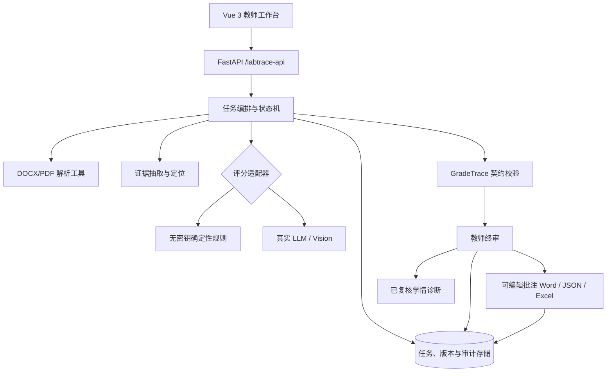

# 高校实验报告批改 Agent 初版工程计划

版本：`v0.2`
计划起点：2026-07-29
风险截止：初赛 2026-08-16；复赛工程按 2026-09-03 前冻结
项目分支：`goaihz`

> 官网赛道页与 2026-07-16 版参赛手册的复赛截止日期不一致。工程倒排采用更早的 9 月 3 日，最终以组委会最新书面通知为准。

## 0. 2026-07-30 实施基线

本计划的初赛 P0 已从“设计目标”进入可部署基线：

- 正式入口固定为 `https://yywebsite.cn/education/`；
- 公开演示同时提供过敏原 ELISA、Unity 游戏开发和温度传感器三个案例；
- 过敏原案例为完全合成教学数据，不作医学诊断；
- 游戏开发案例只参考实际课程任务结构，未复用学生原文、截图、身份或教师信息；
- API 已加入 25 MiB 上传限制、DOCX 解压限制、来源限流、双任务并发、24 小时过期和立即删除；
- 生产容器使用非 root、只读根文件系统、1 GiB 内存上限，只暴露到 Docker 网桥；
- 前端在本地构建，生产机只构建 Python 运行镜像；
- 发布采用不可变 commit release，并在共享 Nginx 中只增加 `/education/` 路由。
- 已复用根项目 MiniMax-M3 主端点，模型输出强制映射同一 `GradeTrace`；
- 支持教师上传真实课程 rubric JSON，并完成现有游戏开发 rubric 兼容验证；
- 外部调用前自动脱敏，图片默认不外发、单任务显式授权；超时/额度/契约失败显式降级；
- MiniMax-M3 已完成一张合成游戏截图的授权发送烟测，图片证据 ID 与契约校验通过；
- 图片证据已能定位回原 DOCX 图片所在段落，并生成 Word 原生批注；
- 教师终审说明、最终成绩和逐项反馈会重新写入交付 Word；
- 对无固定成绩表的任意图文 Word，保留原文、表格和图片并追加可编辑标准批改页；
- 18 项参赛测试覆盖原生批注、教师终审后重新下载、未知模板和图片保留；
- 已用一份授权范围内真实课程报告做工程烟测，不公开原文、不把单次得分当作准确率。

初赛冻结标准是：代码、公开 Demo、PPT/PDF、视频、运行说明与合规口径都指向同一提交，且双案例可以完成“上传图文 Word → 图文证据评分 → 教师复核 → 批注/成绩/教师评语回写 → 可编辑 Word 下载 → 学情诊断 → 数据删除”闭环。

## 1. 工程目标

在不推翻现有 GameAssistant 技术资产的前提下，形成一个能独立运行、公开复现、清楚披露边界的高校实验报告批改 Agent：

1. 初赛版 `v0.1` 稳定证明单份报告完整闭环；
2. 初赛增强版 `v0.2` 接入真实模型和真实课程 rubric，复赛继续补齐批量任务与教师金标评测；
3. 决赛版 `v0.3` 完成部署固化、失败演练和工程材料封版。

核心工程原则：

- **契约优先**：规则模式和真实模型模式都必须输出同一 `GradeTrace`；
- **证据优先**：正分判断必须有可定位证据，分数不能脱离材料；
- **Word 原生交付**：批改结果必须进入教师已有文件流程，不停在聊天回答；
- **人工在环**：正式发布是教师动作，不是模型状态；
- **确定性校验**：总分、范围、引用关系和状态迁移由代码验证；
- **隐私默认**：公开 Demo 只使用合成数据，真实数据默认本地处理和最小保留；
- **可降级**：模型、Vision 或文档注入失败时保留证据和人工接管路径。

## 2. 范围划分

| 优先级 | 范围 | 状态 |
|---|---|---|
| P0 | 单份 DOCX/PDF 上传、解析、六维 rubric、证据链、评分建议、低置信度复核 | 已实现 |
| P0 | 教师调分与说明、批注/成绩/教师评语回写 DOCX、证据 JSON、已复核学情诊断 | 已实现 |
| P0 | 图片到原 Word 段落定位、任意 Word 标准批改页、原图片保留 | 已实现 |
| P0 | 无登录公开 Demo、无密钥离线降级、合成数据、测试和提交材料 | 已实现 |
| P0 | MiniMax-M3 真实建议、教师 rubric JSON、自动脱敏、显式降级 | 已实现 |
| P0 | 错误提示、运行说明、材料内“已实现/计划”口径一致 | 初赛冻结前持续检查 |
| P1 | 真实文本模型、可选图片输入、超时/契约修复/降级 | 已实现；后续做视觉质量标定 |
| P1 | 批量任务、持久化、幂等、删除与保留策略 | 复赛任务 |
| P1 | 教师身份、课程隔离、最小权限和审计检索 | 复赛任务 |
| P1 | 教师金标评测、成本与耗时指标、Excel/CSV 导出 | 复赛任务 |
| P2 | LMS/教务系统集成、复杂学术诚信检测、校级多租户 | 本届不作为主链路 |
| P2 | 模型微调、学生画像和自动发布成绩 | 暂不做；自动发布不符合产品边界 |

## 3. 目标架构

### 当前复用与新增边界

| 层 | 复用根项目 | `goaihz/` 已新增 | 下一步新增 |
|---|---|---|---|
| 前端 | Vue 3、路由、API 客户端 | `/labtrace` 独立工作台 | 批量队列、失败恢复、任务删除 |
| API | FastAPI 应用 | `/labtrace-api` 独立路由 | 身份、课程、批次与指标接口 |
| 解析 | Word/PDF 解析与图像抽取 | 合成样例接入真实解析、图片原段落定位 | 解析质量标记与像素级区域定位 |
| Agent | 工具注册、模型客户端基础 | 确定性评分 + `ModelGradingAdapter`、超时/降级 | 批量模型调度与质量标定 |
| 契约 | rubric 基础 | `EvidenceRef`、`CriterionDecision`、`GradeTrace` | 版本迁移和持久化 schema |
| 复核 | 原项目人工复核基础 | 逐项调分与教师说明 | 角色权限、拒绝/退回、审计查询 |
| 输出 | Word 批注、Excel 能力基础 | 原生批注、成绩、教师评语、通用批改页、trace JSON | 参赛版 Excel/CSV 与批量压缩包 |
| 诊断 | 成绩看板基础 | 仅基于已复核分项的确定性聚合 | 跨批次对比、样本量和置信区间提示 |

## 4. 核心数据契约

### 当前对象

| 对象 | 必要字段 | 不变量 |
|---|---|---|
| `EvidenceRef` | `evidence_id`、类型、来源、定位符、摘录、可靠度 | ID 唯一；来源和定位不可为空；可靠度在 0–1 |
| `CriterionDecision` | 维度、上限、得分、理由、证据 ID、置信度 | 得分不越界；正分必须有证据；置信度在 0–1 |
| `ReviewDecision` | 状态、教师角色、最终分、说明 | 调整/拒绝必须有说明；调整必须有最终分 |
| `GradeTrace` | trace、rubric、匿名提交、证据、分项、总分、复核状态 | 引用必须存在；分项合计等于总分；复核触发必须有原因 |

### 复赛新增对象

- `RubricVersion`：课程、版本、维度、满分、发布人和生效时间；
- `Submission`：匿名标识、课程、文件摘要、授权来源和保留期限；
- `TaskRun`：状态、尝试次数、阶段事件、模型/工具版本、耗时和费用；
- `ReviewEvent`：原值、新值、原因、操作者和时间，采用追加而非覆盖；
- `DeliveryArtifact`：文件类型、校验值、生成状态和下载授权；
- `DiagnosisSnapshot`：样本范围、纳入条件、分项统计、生成时间。

所有契约在入口和持久化前各校验一次；不能通过校验的模型输出不得进入教师发布界面。

## 5. API 计划

### 当前接口

| 方法与路径 | 用途 | 当前状态 |
|---|---|---|
| `GET /labtrace-api/bootstrap` | 产品模式、rubric、样例和 Agent 步骤 | 已实现 |
| `POST /labtrace-api/grade` | 上传单份报告并同步生成评分建议 | 已实现 |
| `GET /labtrace-api/tasks/{task_id}` | 读取任务状态 | 已实现 |
| `POST /labtrace-api/review` | 教师逐项确认/调整并发布 | 已实现 |
| `GET /labtrace-api/tasks/{task_id}/download?kind=source|report|trace` | 下载原始 Word、批注 Word 或含引用附录的证据链 | 已实现 |
| `GET /labtrace-api/sample/{kind}` | 获取合成输入或批改示例 | 已实现 |
| `DELETE /labtrace-api/tasks/{task_id}` | 立即删除上传和衍生文件 | 已实现 |
| `POST /labtrace-api/rubrics/validate` | 校验教师课程 rubric | 已实现 |
| `GET /labtrace-api/sample/rubric` | 下载可复用 JSON 模板 | 已实现 |

### 复赛接口

| 方法与路径 | 用途 | 验收重点 |
|---|---|---|
| `POST /rubrics/validate` | 校验教师上传的 rubric | 分值、维度 ID 和规则错误可定位 |
| `POST /batches` | 创建批量任务 | 幂等键、数量/容量限制 |
| `GET /batches/{id}` | 查询批次与单份进度 | 可恢复，不靠浏览器常驻 |
| `POST /tasks/{id}/retry` | 从失败阶段重试 | 已完成产物不重复生成 |
| `DELETE /tasks/{id}` | 按策略删除报告和衍生物 | 审计保留最小必要记录 |
| `GET /tasks/{id}/audit` | 查看证据、模型、配置和复核事件 | 教师与管理员权限分离 |
| `GET /batches/{id}/export` | 下载 Excel/CSV 和批注文档包 | 只导出已确认结果 |
| `GET /metrics/evaluation` | 输出评测聚合指标 | 只显示脱敏聚合值 |

复赛版把长任务改为异步：创建任务返回 `202 + task_id`，前端轮询或使用现有 WebSocket 展示阶段事件。

## 6. 任务状态与迁移规则

建议统一状态：

`created → parsing → evidence_ready → grading → validating → review_pending → confirmed → delivering → completed`

失败状态：

`parse_failed | model_failed | validation_failed | delivery_failed | cancelled`

关键迁移规则：

- `parsing` 失败时不允许进入评分；
- `validation_failed` 的模型输出只进入诊断日志，不展示成建议分；
- 任一低置信度/证据冲突项使任务进入 `review_pending`；
- 未经过 `confirmed` 不生成“正式”成绩导出；
- `delivery_failed` 可以从交付阶段重试，不重复调用模型；
- 学情诊断只纳入 `approved` 或 `adjusted` 的复核结果；
- 删除请求必须覆盖原文件、解析缓存、图片、模型中间结果和交付物。

## 7. 工程任务清单

### E0：初赛闭环冻结（P0）

- [x] 独立产品目录、rubric、合成报告和项目边界；
- [x] 公开 `/education/` 页面与独立 API；
- [x] 真实文档解析、确定性建议和证据链；
- [x] 低置信度教师复核、过敏原案例 68→70 调整；
- [x] 带批注 DOCX、trace JSON 和班级诊断；
- [x] PPT/PDF、视频、运行说明与提交包；
- [ ] 在干净环境复跑安装、构建和闭环；
- [ ] 确认 LICENSE、字体和第三方素材/依赖边界；
- [ ] 向组委会确认复赛截止时间。

完成定义：公网模式下评委不需要登录或提供密钥即可完成真实模型闭环；断网环境按 README 可切换确定性基线完成同一教师终审链路。

### E1：真实模型适配（P1，已完成初版）

- [x] 保留 `DeterministicDemoAdapter`，增加真实 `ModelGradingAdapter`；
- [x] MiniMax 输出强制结构化并映射到 `GradeTrace`；
- [x] 文本、表格、图片邻近文本统一证据编号，记录图片是否真正发送；
- [x] 增加 90 秒超时、最多两次带具体错误的 JSON 修复、Token/耗时和供应商类别记录；
- [x] 契约校验失败或额度耗尽显式降级，不生成伪模型成功；
- [x] 文本-only 默认路径；图片最多 4 张且必须教师单任务授权；
- [x] 自动替换解析器识别身份及常见联系方式；
- [x] 教师课程 rubric JSON 验证与现有根项目 rubric 兼容。

完成定义：同一输入可以在规则模式和模型模式运行；两者都通过同一契约测试，模型失败不会生成伪成功结果。

### E2：批量、持久化与交付（P1）

- 引入 SQLite 作为单机复赛基线，任务文件按 ID 隔离；
- 批次创建、并发上限、幂等键、阶段重试和断点恢复；
- 保存追加式 `ReviewEvent`，不覆盖模型原建议；
- 加入 Excel/CSV 汇总和批量 DOCX 压缩包；
- 为原文件、缓存、审计和产物分别配置保留期限；
- 实现单任务删除和批次删除的可验证结果。

完成定义：30 份样例任务可以限流执行；服务重启后状态可恢复；只导出已确认成绩；删除后检查不到原始材料和衍生文件。

### E3：身份、隐私与审计（P1）

- 最小角色：教师、助教、管理员；
- 课程与批次隔离，助教不可发布超出授权课程的成绩；
- 上传前隐私提示、可配置本地模式和外部 API 披露；
- 审计记录模型/端点类别、rubric、工具、教师操作和产物摘要；
- 日志屏蔽报告正文、密钥、真实姓名和绝对隐私路径；
- 完成数据来源与教师授权模板。

完成定义：跨课程访问被拒绝；公开日志与提交包通过敏感信息扫描；教师能查看一次成绩形成的完整记录。

### E4：评测与工程复现（P1）

- 准备至少 30 份经授权脱敏的教师金标样本；
- 固化样本清单、rubric 版本和拆分规则；
- 自动计算总分 MAE、5 分内一致率、证据覆盖率、高风险召回率；
- 记录教师纯人工与 Agent 辅助的单份中位耗时；
- 做无 Vision、无证据契约、无人工复核三组消融；
- 在两个干净环境完成一键部署验证。

完成定义：所有数字可从固定命令重算，报告同时公开失败样本和限制，不把目标值写成已达成结果。

### E5：答辩封版（P0）

- 冻结代码提交、模型/依赖版本、rubric 和样例校验值；
- 准备现场运行、离线录屏和静态产物三级备份；
- 完成一次主链路与至少一次失败注入演练；
- 更新 PPT 中的真实评测结果和工程架构；
- 输出最终运行说明、数据说明、开源边界和变更清单。

完成定义：断网情况下仍可演示确定性闭环；模型模式不可用时能解释并展示降级；所有材料中的数字一致。

## 8. 倒排里程碑

| 日期 | 里程碑 | 必须交付 |
|---|---|---|
| 7/29–8/02 | M0 初赛工程冻结 | 闭环方案、工程计划、包验证、干净环境运行记录 |
| 8/03–8/07 | M1 体验与异常补强 | 错误状态、失败接管、演示预检清单 |
| 8/08–8/11 | M2 材料一致性检查 | PPT/PDF/视频/简介中的功能与数字一致 |
| 8/12–8/15 | M3 提交缓冲 | 最终压缩包、校验值、备用上传和提交截图 |
| 7/30–8/02 | M0.5 模型增强 | `ModelGradingAdapter`、真实模型路径、脱敏、教师 rubric、降级测试 |
| 8/17–8/23 | M4 模型评测 | 失败样本归因、视觉质量标定、成本/耗时基线 |
| 8/24–8/29 | M5 批量与持久化 | SQLite、批次、重试、删除、Excel/CSV |
| 8/30–9/02 | M6 金标评测与封版 | 30 份评测、指标报告、两环境复现 |
| 9/03 | 复赛风险截止 | 冻结并提交可运行工程材料 |
| 9/04–9/15 | M7 决赛强化 | 权限审计、失败注入、性能/成本与答辩问答 |
| 9/16–9/21 | M8 决赛封版 | 现场包、离线包、路演 PPT 和最终演练 |

若组委会确认复赛可提交到 9 月 23 日，多出的时间只用于补充评测和稳定性，不推迟 9 月 3 日的可运行版本。

## 9. 单人项目的工作节奏

队名使用“独立变量”时，单人同时承担产品、工程、测试和材料，但每天只推进一个可验收纵切，避免多线半成品：

| 每周节奏 | 活动 |
|---|---|
| 周一 | 锁定本周一个用户结果与验收案例 |
| 周二至周三 | 完成后端契约、核心实现和单元测试 |
| 周四 | 接前端、跑 API/浏览器闭环和异常用例 |
| 周五 | 更新文档、录制证据、冻结可回滚版本 |
| 周末缓冲 | 只修 P0 阻断问题或准备评测材料 |

需要外部协作但不计入开发人力的事项：

- 任课教师：确认课程 rubric、提供授权金标和记录人工耗时；
- 学校/课程负责人：确认数据处理授权、保留期限和发布流程；
- 组委会：确认复赛截止、材料格式和仓库公开要求。

## 10. 测试矩阵

| 层级 | 关键用例 | 阻断条件 |
|---|---|---|
| 契约单测 | 分数越界、总分不一致、未知证据、缺理由、非法复核状态 | 任一不变量可绕过 |
| 解析测试 | DOCX/PDF、无表格、无图片、损坏文件、超大文件 | 损坏文件仍生成分数 |
| API 闭环 | bootstrap、grade、review、download、task reload、delete | 动态建议无法终审，或离线 68→70 回归、产物下载/删除失败 |
| 状态测试 | 重试、重复提交、服务重启、删除 | 出现重复发布或状态倒退 |
| 前端 E2E | 加载样例、运行、查看证据、调整、确认、下载 | 需要开发者工具才能继续 |
| 文档产物 | 批注数量、定位、最终分、Word 可打开 | 产物损坏或分数与 trace 不一致 |
| 隐私安全 | PII 扫描、路径/密钥日志、跨课程访问 | 公开包出现真实个人信息或密钥 |
| 评测复现 | 固定样本与版本重复运行 | 指标无法从原始记录重算 |
| 性能稳定 | 30 份批量、限流、失败恢复 | 服务重启后任务丢失 |

发布门槛按风险排序：契约、隐私、教师发布边界和产物一致性是硬门槛；视觉微调不得阻塞这些门槛。

## 11. 可观测性与复现记录

每次任务至少记录：

- `task_id`、代码提交、运行配置和开始/结束时间；
- 文件摘要而非公开真实文件名；
- rubric ID/版本、模型与端点类别、工具版本；
- 每阶段状态、耗时、重试和归一化错误码；
- Token/费用估算，若为无密钥模式则显式记为规则模式；
- 原评分建议、教师复核事件和最终结果；
- 交付物类型、SHA-256 与删除时间。

默认日志不记录完整报告正文、完整证据摘录、API 密钥和真实学生标识。

## 12. 风险清单

| 风险 | 触发信号 | 缓解措施 |
|---|---|---|
| 真实模型输出不稳定 | JSON 解析失败、证据 ID 幻觉 | 强 schema、最多两次定向修复、契约阻断、规则模式备份 |
| 图片理解失败 | 图像不可读或超时 | 标记未观察模态，降级文本模式并触发复核 |
| 课程 rubric 差异大 | 教师大量改分 | rubric 版本化，先聚焦一类理工科报告验证 |
| 教师金标不足 | 8 月中仍无授权样本 | 先完成合成异常集；尽早锁定 1 位教师与 30 份样本 |
| 隐私或权属不清 | 数据来源、第三方依赖或模型条款变化 | 只公开合成数据；Apache-2.0 与第三方/模型许可分开披露，持续做敏感文件扫描 |
| 单人时间不足 | P1 同时开工超过两项 | 坚守 P0/P1，LMS、微调和多租户全部延期 |
| 赛事时间冲突 | 官网与手册日期不同 | 按 9 月 3 日封版，书面询问组委会 |
| 现场网络/模型不可用 | API 延迟或额度异常 | 无密钥本地模式 + 录屏 + 静态产物三级备份 |

## 13. 阶段验收

### 初赛 Gate

- 一条三分钟内可完成的公开闭环；
- 作品简介、PPT/PDF、视频、运行说明和合规说明齐全；
- 材料明确区分真实模型结果与确定性回归基线；
- 合成数据和工程包通过隐私与一致性检查。

### 复赛 Gate

- 真实模型与无密钥模式共享 `GradeTrace`；
- 至少 30 份授权脱敏样本的可复算评测；
- 批量、持久化、重试、删除和 Excel/CSV 交付可运行；
- 两个干净环境可复现，失败路径有明确人工接管。

### 决赛 Gate

- 现场主链路与失败注入均演练通过；
- 模型、代码、依赖、rubric、样本和指标全部冻结；
- 权限、隐私、成本和教育评价边界可在答辩中给出工程证据；
- 离线备份不依赖外网或商业 API。

## 14. 首批下一步任务

按顺序执行，不并行摊大饼：

1. 在一台干净环境按 README 完成启动并保存运行记录；
2. ~~完成独立仓库 Apache-2.0、NOTICE 与第三方/数据边界说明~~；
3. 定义 `GradingAdapter` 接口及规则适配器契约测试；
4. ~~选择一个真实模型配置完成 `GradeTrace` 映射~~（MiniMax-M3 已完成）；
5. 锁定一位课程教师和 30 份授权脱敏报告，建立金标而非只做烟测；
6. 再实现 SQLite 批量队列、删除策略和 Excel/CSV 导出。
