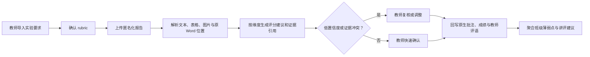

# 产品与赛道定位

## 一句话

格物智评 LabTrace 是面向高校实验课程教师的图文 Word 原生批改 Agent：它理解报告里的正文、表格和图片，把评分依据定位回原 Word，在教师终审后写入原生批注、成绩和教师评语，最终交还可继续编辑的 Word。

产品承诺很具体：

> 上传一份图文 Word，交还一份已批注、可编辑的 Word。

## 为什么不是“自动打分器”

实验报告批改不是一条 Prompt。真实教师工作包含标准解释、材料检查、图表判断、证据定位、批注、评语撰写、成绩登记和共性问题讲评。只输出一个分数或一段建议，教师还要把结果手工搬回 Word，既没有完成任务，也难以复核。

LabTrace 把价值放在三个地方：

- 提效：机械解析、逐项核对、原位批注、成绩与评语回填由 Agent 承担；
- 提质：每个评分维度都能回到正文、表格、图像、代码或结果证据；
- 控险：低置信度和证据冲突自动进入复核，正式成绩与教师评语由教师确认后才写回交付文档。

## 目标用户

首要用户是每学期需要批改几十到数百份 Word/PDF 实验报告的高校教师与助教，尤其适合编程、仿真、数据分析、工程实践和通用理工科实验课程。

## 最小可演示闭环

## 与 AI+教育评审点的对应

| 评审关注 | 作品证据 |
|---|---|
| 行业场景价值 | 真实教师批量批改流程，已有课程与报告处理基础 |
| Agent 能力与闭环 | 任务理解、rubric、工具调用、多模态证据、验证、人工复核、结果交付 |
| 产品体验与 Demo | 图文 Word 上传、图片授权、证据定位、教师终审、可编辑批注 Word 下载 |
| 技术实现深度 | 文档结构解析、Vision、工具协议、证据契约、模型降级、可测试模块 |
| 安全合规 | 模拟/授权脱敏数据、最小化、教师终审、置信度与审计记录 |
| 开放复用 | 通用 rubric、证据契约、诊断模块、模拟数据、评测与部署文档 |

## 当前能力与下一阶段

当前参赛版已经跑通公开真实模型闭环：复用 MiniMax-M3 生成建议，模型只允许引用脱敏证据目录；经教师单次授权的图片最多发送 4 张、合计 6 MiB，并通过 `image:序号@paragraph:原Word段落` 映射回图片所在位置。结果通过 `GradeTrace` 契约后进入教师终审，最终把批注、分数和教师说明写回 Word。固定模板填写原有区域；未知模板保留原文、表格和图片，追加标准批改页。PDF 仍可解析和评分，但不会伪称能够回写原 Word。

复赛前的关键工程工作已经从“接上模型”转为“证明模型质量”：增加批量队列、持久化和课程权限，再用经授权脱敏的教师金标数据测量总分 MAE、证据覆盖、高风险召回、耗时和成本。详细分界见 [闭环演示方案](closed_loop_demo_plan.md)和[初版工程计划](engineering_plan_v1.md)。
